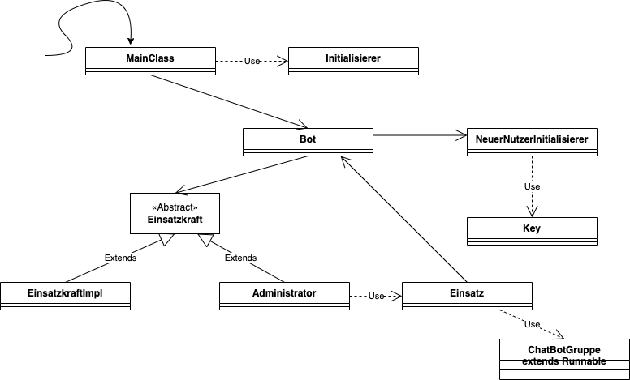

# UNITRESPOND
This bot was written so that emergency forces of a disaster control unit can get an overview of which force resources they can fall back on in order to dispatch additional forces if necessary.


## Authors

- [@alkock](https://www.github.com/alkock)


## Installation

Configure the config.properties first!

Run with:
```bash
  java -jar unitrespond.jar
```
Requires atleast Java Version 8


## License

[MIT](https://choosealicense.com/licenses/mit/)


## UML

